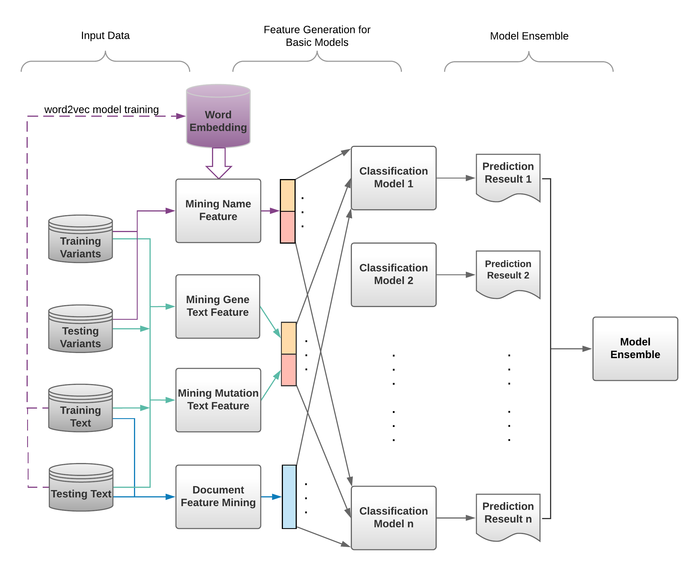

# NeurIPS17-Competition-Classifying-Genetic-Mutations

Our solution is the Top-1 winner of the NeurIPS competition of [Classifying Clinically Actionable Genetic Mutations](https://www.mskcc.org/trending-topics/msk-advances-its-ai-machine-learning-nips-2017). For more details, please refer to [kaggle](https://www.kaggle.com/c/msk-redefining-cancer-treatment). This repository contains the [slides](https://github.com/sheryl-ai/NeurIPS17-Competition-Classifying-Genetic-Mutations/blob/master/NeurIPS%20workshop.pdf) we presented in NeurIPS 2017. The illustration of our proposed framework is:
<p align="center"></p>

Please send your email to [Xi Sheryl Zhang](https://www.xi-zhang.net/) <sheryl.zhangxi@gmail.com> and Dandi Chen <dandichen.cs@gmail.com> with questions and comments associated with the code.


Table of Contents
=================

- Environment Setting Up
- Directory Structure
- Dataset
- Demo
- Usage Example
- Parameters
- Reference


Environment Setting Up
======================

The following instructions are based on Ubuntu 16.04 and Python 3.6.

1) Install Anaconda.<br />
	a) Download Anaconda at your working directory by typing 'wget https://repo.continuum.io/archive/Anaconda3-5.0.1-Linux-x86_64.sh'
	in the terminal.

	b) Install Anaonda by typing 'bash Anaconda3-5.0.1-Linux-x86_64.sh' at your working directory. Then follow the instruction on the screen.

	c) Run the command 'source ~/.bashrc' in the terminal. After that, you are supposed to run python within Anaconda. To check it, run the
	command 'python' in the terminal, and it should print something similar to 'Python 3.6.3 |Anaconda, Inc.| (default, Oct 13 2017, 12:02:49)'.


2) Install NLTK data. <br />
	Please make sure the nltk.path is set correcly if you customize installation path.
	Follow the instruction at http://www.nltk.org/data.html to install NLTK data. Or you can simply run the command 'python -m nltk.downloader all'
	in ubuntu terminal.

	If you choose a different path to install NLTK data, please add the path to let nltk know.
	Example code('ubuntu' in path.append() stands for the username)
	from nltk.data import path
	path.append('/home/ubuntu/software/nltk_data')

3) Install XGBoost and LightGBM.<br />
	Run the commands 'conda install -c conda-forge xgboost' and 'conda install -c conda-forge lightgbm' seperately to install both XGBoost and LightGBM.

	Other install options for XGBoost and LightGBM can be found at http://xgboost.readthedocs.io/en/latest/build.html and
	https://github.com/Microsoft/LightGBM/blob/master/docs/Installation-Guide.rst.


4) Install other necessary packages, including:<br />
	a) ahocorasick(https://pypi.python.org/pypi/pyahocorasick/#api-overview). <br />
	Run the command 'pip install pyahocorasick' directly. If you meet some problems, try to install other packages used by pyahocorasick, such as gcc, by running 'sudo apt install gcc'. Before that, you may need to update the package lists for upgrades for packages that need upgrading by running 'sudo apt-get update'. Thus, the correct order for intalling pyahocorasick is: first update package lists, then install gcc. Finally install pyahocorasick.

	b) gensim. <br />
	Please refer to https://radimrehurek.com/gensim/install.html for installation guide, or you can run 'conda install -c anaconda gensim' in the terminal directly.

	c) testfixtures. <br />
	Simply run 'conda install -c conda-forge testfixtures'.

	d) jsonlines. <br />
	Command is 'conda install -c conda-forge jsonlines'.


Notes:
1) Anaconda is always the first one that needs to be installed. Installation orders of all other packages can be different.

2) Installation commands summary: <br />
wget https://repo.continuum.io/archive/Anaconda3-5.0.1-Linux-x86_64.sh <br />
bash Anaconda3-5.0.1-Linux-x86_64.sh <br />
source ~/.bashrc <br />
python -m nltk.downloader all <br />
conda install -c conda-forge xgboost <br />
conda install -c conda-forge lightgbm <br />
sudo apt-get update <br />
sudo apt install gcc <br />
pip install pyahocorasick <br />
conda install -c anaconda gensim <br />
conda install -c conda-forge testfixtures <br />
conda install -c conda-forge jsonlines


Directory Structure
===================

Please make sure your directories/files are satisfied the following structure before running the code.
```bash
.
├── classifier
│   ├── lightgbm.py
│   ├── logistic_regression.py
│   ├── multi_layer_perceptron.py
│   ├── random_forest.py
│   ├── svc.py
│   └── xgboost.py
├── cross_validation
│   └── nfold_cv.py
├── data
│   ├── 5fold_cv
│   ├── features
│   ├── intermediate
│   ├── models
│   │   ├── doc2vec
│   │   └── word2vec
│   ├── pre_define
│   │   ├── 5fold.map.pkl
│   │   ├── Actionable.txt
│   │   ├── chemical.tsv
│   │   ├── disease.tsv
│   │   ├── gene.tsv
│   │   ├── mutation.tsv
│   │   ├── nips.10k.dict.pkl
│   │   ├── pubmed.jsonl
│   │   ├── pubmed_stopword_list.txt
│   │   └── tree_feat_dict.pkl
│   ├── stage1_variants
│   ├── stage2_variants
│   ├── stage1_solution_filtered.csv
│   ├── stage1_test_368
│   ├── stage_2_private_solution.csv
│   ├── stage2_sample_submission.csv
│   ├── stage2_test_text.csv
│   ├── stage2_test_variants.csv
│   ├── test_text
│   ├── test_variants
│   ├── training_text
│   └── training_variants
├── ensemble
│   ├── feature_fusion.py
│   └── result_ensemble.py
├── feature
│   ├── document_mining.py
│   ├── name_mining.py
│   └── relation_mining.py
├── helper.py
├── ReadMe
├── demo.py
└── run.py
```

Note:
1) 5fold.map.pkl is a pre-defined 5 fold cross-validation split for testing only.
2) tree_feat_dict.pkl is a pre-defined Python dictionary for recommended number of trees in random forest classifier.
Each single feature has recommended number of trees as classifier parameter in random forest only.
3) chemical.tsv, disease.tsv, gene.tsv, mutation.tsv are collected online by bioentity names.
4) pubmed.jsonl and pubmen_stopword_list.txt are generated from PubMed.
5) nips.10k.dict.pkl stores top 10k words in text data.
6) embedding learning will take time. Instead, get the pretrained word2vec/doc2vec from [here](https://www.dropbox.com/sh/b2ihtdmek80zopz/AABo2k5Lo8qHLxHC4Enpg2J9a?dl=0) and copy them under the folder 'models'.

Dataset
==========
The input data can be found via [kaggle's page](https://www.kaggle.com/c/msk-redefining-cancer-treatment/data) or [data](https://www.dropbox.com/sh/hu60k46tfpss30g/AADTYPLvAo7ts6QlxLP3YJL_a?dl=0). Copy the input files into the folder 'data'. The necesesary files in other folders including 'features' and 'intermediate' will be generated by running the code at the first time.

The index map of the predefined 9 Classes is:
```bash
CLASS_NUM_MAP ={'Likely Loss-of-function':1, 'Likely Gain-of-function':2, 'Neutral':3,
                'Loss-of-function':4, 'Likely Neutral':5, 'Inconclusive':6, 'Gain-of-function':7,
                'Likely Switch-of-function':8, 'Switch-of-function':9}
```


Demo
==========
Run demo.py to show the prediction results by giving a gene name and a variation name as the following example:
```bash
python demo.py -gene=TGFBR1 -variation=S387Y
```
The predicted results should be:
```bash
ID: 95 Gene: TGFBR1 Variation: S387Y
  class         prediction      groundtruth         
    1      0.06485872604678475       0.0
    2      0.0020891761251413538     0.0
    3      0.0011311423530236504     0.0
    4      0.9245424266930476        1.0
    5      0.0017318023781274679     0.0
    6      0.0017330807090426808     0.0
    7      0.002021304704367886      0.0
    8      0.0009614994703982653     0.0
    9      0.0009308415200664855     0.0
```
The list of <gene, variation> can be found in the file 'data/stage1_variants'.

Parameters
==========

XGBoost parameters: https://github.com/dmlc/xgboost/blob/master/doc/parameter.rst <br />
LightGBM parameters: http://lightgbm.readthedocs.io/en/latest/Parameters.html


Usage Example
=============

The source code contains four major sections: learning features, classification, ensembling and cross-validation.

To run all four sections, switch to the path with the run.py in the code. Then run 'python run.py'.
To run a few sections, please refer to run.py to comment some lines, such as comment line starts with 'ensemble' in main() to run classification section only.

Note:
1) pos_tagging_nmf() needs to be called after calling pos_tagging_feats() in helper.py.
2) It is time-consufing to run all four sections at once. It may take several days to finish without parallel settings, depending on computation power.


Reference
=============

If you find this project useful in your research, please consider citing our paper:
```
@incollection{zhang2018multi,
  title={Multi-view Ensemble Classification for Clinically Actionable Genetic Mutations},
  author={Zhang, Xi and Chen, Dandi and Zhu, Yongjun and Che, Chao and Su, Chang and Zhao, Sendong and Min, Xu and Wang, Fei},
  booktitle={The NIPS'17 Competition: Building Intelligent Systems},
  pages={79--99},
  year={2018},
  publisher={Springer}
}
```
This paper can be accessed on : [Classifying Genetic Mutations] (https://arxiv.org/pdf/1806.09737.pdf)
